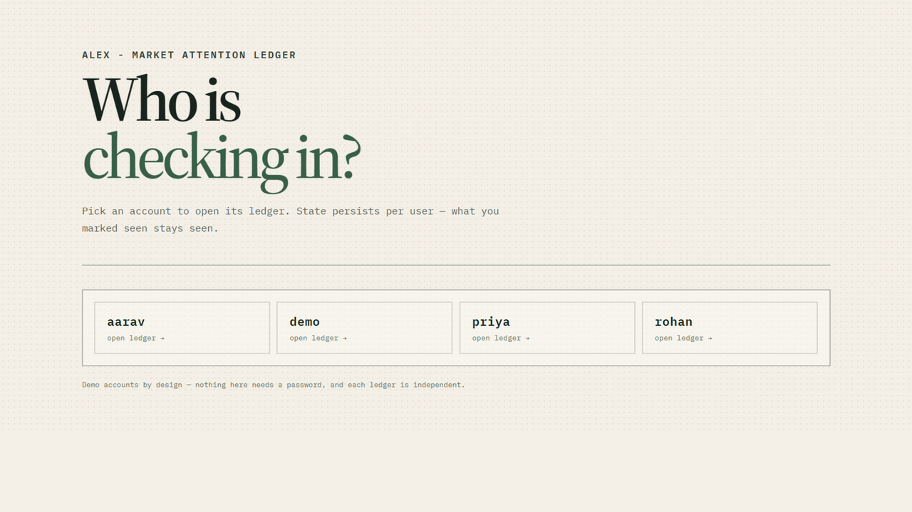
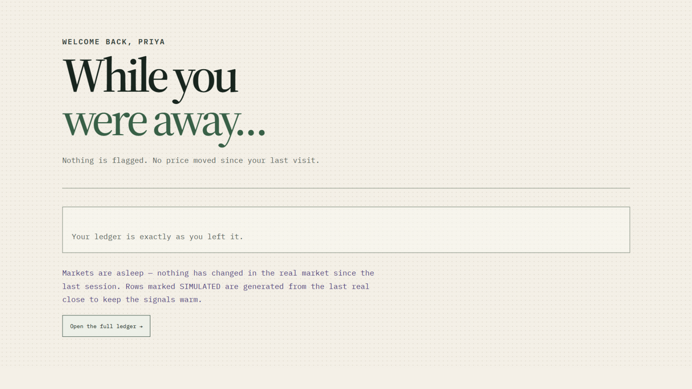
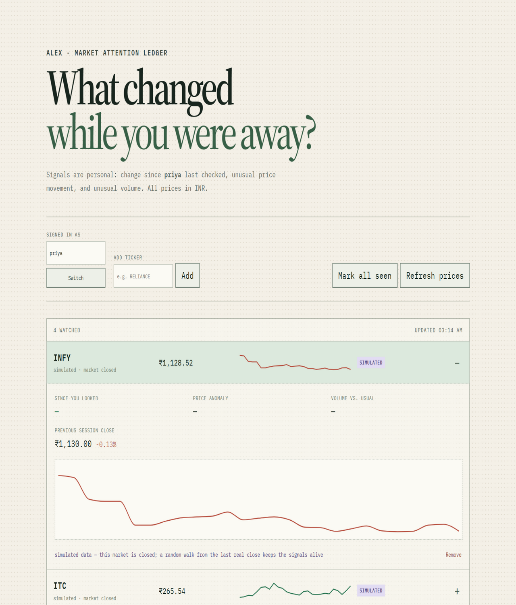

# Alex Watchlist

An attention-first market watchlist built for Groww Code 2026. It answers **what changed while I was away?** rather than presenting an undifferentiated price list.

**Live demo**: [alex-market-attention-ledger.vercel.app](https://alex-market-attention-ledger.vercel.app) · API: [alex-watchlist-api.onrender.com/docs](https://alex-watchlist-api.onrender.com/docs)

## Screenshots

**Login** — pick an account; state persists per user, across sessions and devices.



**"While you were away" summary** — the landing moment: what moved since your last visit, with an honest note when markets are closed.



**The ledger** — expandable rows with the three explainable signals, price history chart, and full source provenance.



## What it does

- **Two live sources, no synthetic generator**: Yahoo Finance's keyless chart endpoint is primary; Twelve Data (`/quote`, free tier, throttled to ~800 requests/day) cross-checks when an API key is set. Dual-listed tickers resolve NSE-first (INFY is Infosys Ltd, not the NYSE ADR), and bare NSE tickers are retried with `.NS` automatically.
- **Everything is displayed in INR.** Quotes are stored in their native currency and converted once at the API boundary using a cached live USD/INR rate (`INR=X`, refreshed every 5 minutes). NSE quotes are never double-converted.
- **Conflict handling is real and visible.** When both sources respond, both are converted to INR first, then compared. A spread beyond 0.5% is a real conflict: the fresher timestamp wins, and the expanded row shows both disagreeing values and which source was used. A lone source is marked single-sourced, not silently agreed-upon.
- **Three independent, explainable signals** per row: change since *you* last looked, price anomaly z-score, and volume versus its rolling average. A row is flagged when any signal crosses its named threshold — never via a blended score.
- **A "While you were away" summary screen** on login: flagged count, top movers since your last visit, and a market-asleep note.
- **Closed markets are handled honestly.** A symbol whose provider timestamp stops advancing is asleep (night, weekend, holiday — no exchange calendar needed). Its row keeps updating from a clearly-labelled `SIMULATED` random walk that mean-reverts toward the last real close, so the signals stay demoable without faking live data: simulated rows never become seen-baselines, never enter real signal history, never participate in conflict resolution, and get their own small retention window so they can never evict real history.
- **History is real from minute one.** A newly added symbol backfills ~26 intraday bars from Yahoo, and unchanged quotes are never re-stored — so z-scores and volume ratios have genuine variance instead of 15-second duplicates.
- **Honest freshness.** Feed staleness ("we haven't reached this symbol in 45s") is separate from market closure, and the UI shows data age, source, and resolved conflicts on every row.
- **A footer stat** ("N unique symbols tracked across M users") is the demoable proof that ingestion is deduplicated per symbol, not per user-per-symbol — the actual scaling lever.

## Run it locally

```powershell
cd backend
.\.venv\Scripts\python -m uvicorn app.main:app --reload
```

```powershell
cd frontend
npm run dev
```

Visit `http://localhost:5173`, pick an account, and add tickers — NSE names (`RELIANCE`, `TCS`, `M&M`), US names (`AAPL`), and spaced input (`hdfc bank` → `HDFCBANK`) all work.

Optional secondary source:

```powershell
$env:TWELVE_DATA_API_KEY="your-key"
.\.venv\Scripts\python -m uvicorn app.main:app --reload
```

Without the key every row is honestly labelled single-sourced; with it, US symbols get true dual-source conflict checking (Twelve Data's free plan does not cover NSE symbols).

## Deploy

- **Backend**: `render.yaml` deploys to Render's free tier. Two documented caveats: free-tier services sleep after ~15 minutes without traffic (the background poller only runs while awake — expect a ~30s cold start), and SQLite sits on an ephemeral disk, so data survives restarts but resets on redeploy. Set `TWELVE_DATA_API_KEY` and `ALLOWED_ORIGINS` (the frontend URL, comma-separated) in the dashboard.
- **Frontend**: Vercel/Netlify, root directory `frontend/`, with `VITE_API_BASE` set to the backend URL at build time (see `frontend/.env.example`).

## Verification

```powershell
cd backend
.\.venv\Scripts\python -m pytest tests -q

cd ..\frontend
npm run build
```

Tests mock both providers at the boundary (no network) and include regression tests for the failure modes actually encountered while building: a listing change that makes fresh rows carry older provider timestamps, simulated rows evicting real history from retention, a closed-market walk drifting from its anchor, and dual-listed ticker resolution.

## Design decisions and trade-offs

**Polling, not streaming.** A 15-second backend poller and 10-second UI refresh are predictable and debuggable; the provider interface isolates ingestion so WebSockets can replace polling without changing the API or UI. Symbols are deduplicated across users before ingestion.

**Storing less, more honestly.** Snapshots are persisted only when the market event changes; feed freshness lives in `symbols.last_polled_at`, so a stable market is never mistaken for a broken feed.

**No passwords.** Login is a picker over seeded accounts — the thing being demonstrated is per-user state persistence, not access control. Real auth would be OAuth or magic links in front of the same username-scoped data model; nothing in the backend changes.

**No AI feature.** Every signal is deterministic and auditable. The UI shows the exact threshold that caused a flag, avoiding opaque or investment-advice-like recommendations.

**Scaling story.** Single-process SQLite with WAL is the honest choice for a demo; the next steps are named, not hidden — Postgres for multi-writer safety, a dedicated ingestion worker, and provider failover beyond two sources.
